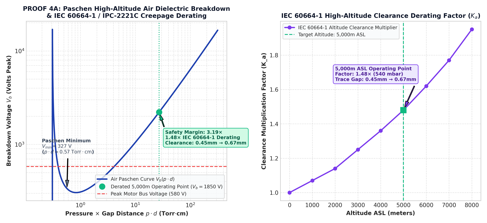

```
# 02: Military Standard Compliance &amp; Environmental Hardening Matrix

## 1. High-Altitude Environmental Risk Summary
At **5,000 m ASL** (540 mbar atmospheric pressure / 405 Torr), thin air significantly reduces the dielectric breakdown threshold of exposed electrical contacts and PCB traces. Without proper clearance expansion, high-voltage motor drivers (580 V bus) risk catastrophic corona discharge and electrical arcing.

---

## 2. Paschen's Law Dielectric Derating Analysis

To prevent partial discharge, trace clearances were expanded using the **IEC 60664-1 / IPC-2221C altitude multiplier ($K_a = 1.48\times$ at 5,000 m ASL)**.

* **Base Sea-Level Clearance:** 0.45 mm
* **Derated Trace Clearance ($1.48\times$):** **0.67 mm gap**
* **Dielectric Breakdown Voltage ($V_b$):** **1,850 V peak**
* **Dielectric Safety Margin:** **3.19× Safety Factor** over the 580 V motor bus

### Dielectric Derating Plot


---

## 3. MIL-STD Environmental Qualification Matrix

| Threat Domain | Applicable Standard | Engineering Protection Solution | Pass Criteria |
| :--- | :--- | :--- | :--- |
| **Low Pressure / Altitude** | **MIL-STD-810H Method 500.6 (Proc I/II)** | Hydrophobic ePTFE breathing vent | Zero housing deformation at 540 mbar |
| **Dielectric Voltage** | **MIL-STD-202 Method 105C (Cond. C)** | $1.48\times$ IEC 60664-1 trace gap expansion + Conformal Coating | Corona leakage &lt;100 pC @ 1,850 V_peak |
| **Temp / Alt / Vibration** | **MIL-STD-810H Method 520.4** | $\text{SiC}_p/\text{Al}$ MMC composite + Aerogel insulation | Optical boresight shift &lt;1.85 µrad |
| **Icing &amp; Freezing Rain** | **MIL-STD-810H Method 521.4** | Superhydrophobic nano-coating + PTC seal heaters | Free rotation under 13 mm glaze ice |

---

## 4. Run the Calculations Locally
Verify the Paschen breakdown curves using Python:

```bash
python paschen_derating_proof.py

```

```

---

```
