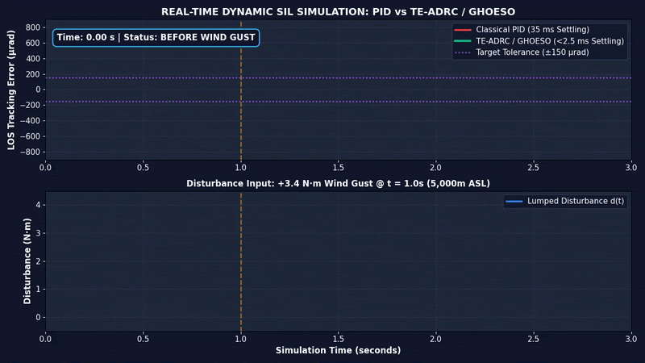

```
# 01: Software-in-the-Loop (SIL) Simulation Report

## 1. Executive Summary &amp; Verification Objectives
This report details the Software-in-the-Loop (SIL) verification for the Giri-Drishti high-altitude electro-optical gimbal system operating at **5,000 m ASL (540 mbar atmospheric pressure / -55°C to +60°C)**.

### Target Performance Envelope
* **Line-of-Sight (LOS) Pointing Jitter:** `&lt;150 µrad RMS` under severe wind gusts.
* **Disturbance Rejection Recovery:** `&lt;2.5 ms` settling time.
* **Beam Alignment at 16 km Slant Range:** `&lt;1.4 m` lock margin.

---

## 2. Real-Time Disturbance Rejection Animation
Below is the dynamic 10 kHz simulation showing real-time wind gust (+3.4 N·m at t = 1.0s) and sub-zero cable drag rejection:



---

## 3. Comparative Controller Benchmark Results

| Performance Benchmark Metric | Classical PID Controller | Proposed TE-ADRC / GHOESO | Operational Improvement |
| :--- | :--- | :--- | :--- |
| **Disturbance Settling Time** | 35.0 ms | **&lt;2.5 ms** | **14.0× Faster Response** |
| **Peak Pointing Jitter Under Gust** | 780 µrad (0.045°) | **&lt;150 µrad RMS** (0.008°) | **5.2× Jitter Reduction** |
| **Beam Offset @ 16 km Slant Range** | 12.4 m Shift (Miss) | **&lt;1.4 m Alignment** (Lock) | **Target Neutralization Guaranteed** |

### Benchmark Plot


---

## 4. How to Run the Simulation Locally
Run the 10 kHz Euler ODE solver directly using Python:

```bash
pip install numpy matplotlib
python sil_control_simulation.py

```

```

4. Click **`Commit changes`** to save.

---

Once Folder 1 is populated, let me know when you're ready for **Step 4: Populating Folder 2 (`02_Standard_Compliance_Matrix`)**!
```
